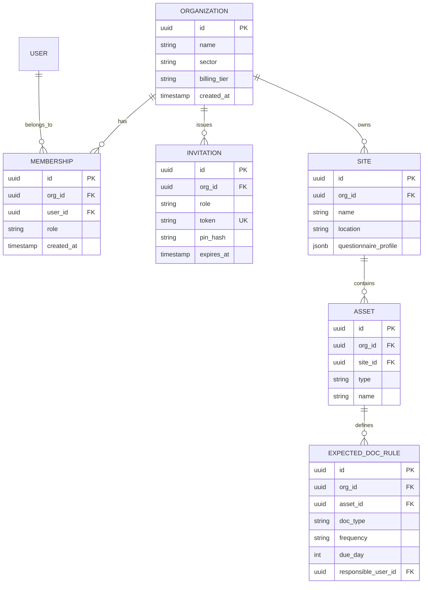
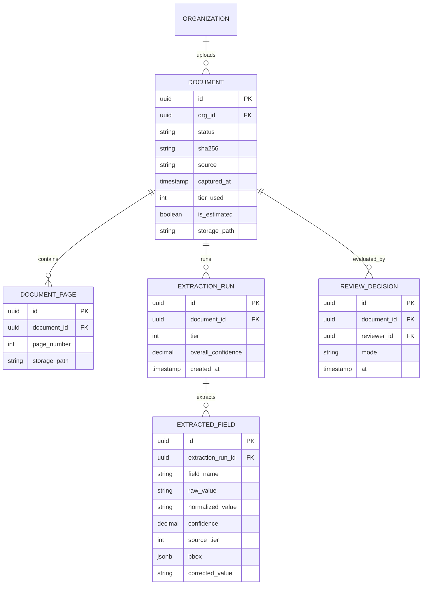
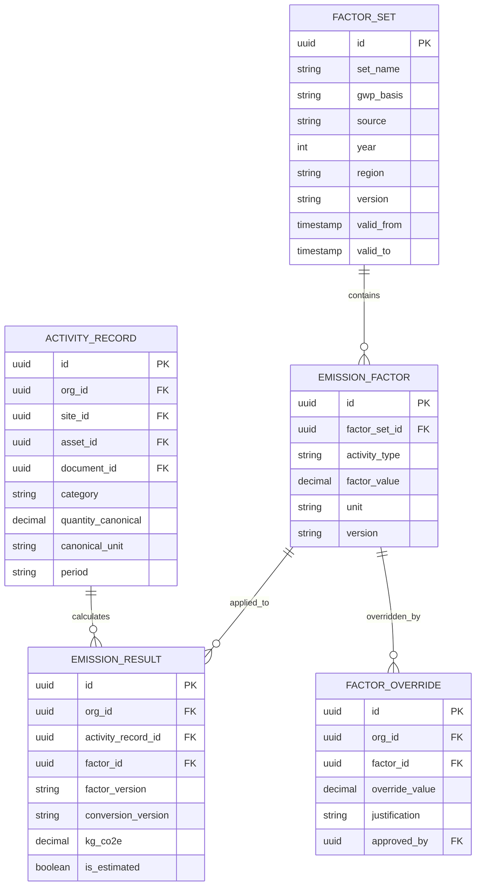
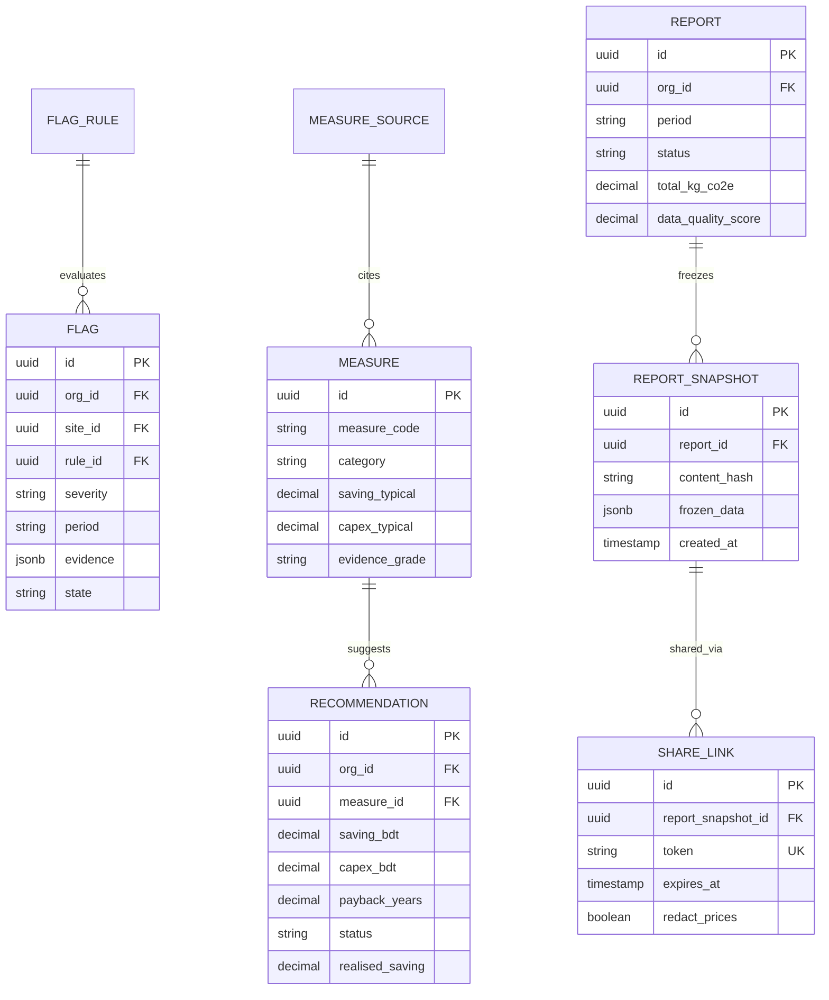

# 04. Data Model Specification: CarbonBill

## 1. Global Data Model Constraints

1. **Multi-Tenant Isolation:**
   - Every tenant-scoped table carries an `org_id uuid NOT NULL` foreign key referencing `identity.organizations(id)`.
   - Tenant isolation is strictly enforced via EF Core global query filters in application code AND PostgreSQL Row-Level Security (RLS) policies at the database layer.
2. **Numeric Precision Standards:**
   - **Monetary Amounts:** `numeric(18,2)` representing values in Bangladeshi Taka (BDT).
   - **Quantities, Fuel Volumes, Energy, Activity & Emission Factors:** `numeric(18,6)`.
   - Floating-point data types (`float`, `double`) are **prohibited**.
3. **Database Schema Isolation:**
   - Each module owns a dedicated PostgreSQL schema (e.g. `identity`, `onboarding`, `documents`, `extraction`, `review`, `activity`, `factors`, `calculation`, `gaps`, `flags`, `insights`, `recommendations`, `reporting`, `notifications`, `audit`, `admin`).

---

## 2. Entity Relationship Diagrams by Module Group

### 2.1 Identity, Tenancy & Onboarding

### 2.2 Documents, Extraction & Review

### 2.3 Activity, Factor Registry & Calculation

### 2.4 Flags, Recommendations, Insights & Reporting

---

## 3. Database Tables Grouped by Owning Module

### Module 1: Identity & Tenancy (`identity` schema) - Dev 1

#### `identity.organizations`
| Column | Type | Constraints | Notes |
|---|---|---|---|
| `id` | `uuid` | PK, default `gen_random_uuid()` | Unique tenant identifier |
| `name` | `varchar(200)` | NOT NULL | Registered factory company name |
| `sector` | `varchar(50)` | NOT NULL | e.g. `RMG`, `TextileDyeing`, `Food` |
| `billing_tier` | `varchar(50)` | NOT NULL, default `'Pilot'` | Subscription / billing tier |
| `consent_ai_tier3` | `boolean` | NOT NULL, default `false` | Customer consent for Tier 3 vision LLM |
| `created_at` | `timestamptz` | NOT NULL, default `now()` | Registration timestamp |

#### `identity.users`
| Column | Type | Constraints | Notes |
|---|---|---|---|
| `id` | `uuid` | PK, default `gen_random_uuid()` | User identifier |
| `email` | `varchar(255)` | NULL, UNIQUE | Optional for floor staff using QR/PIN |
| `phone_number` | `varchar(20)` | NULL | Mobile contact number |
| `full_name` | `varchar(150)` | NOT NULL | User name |
| `pin_hash` | `varchar(255)` | NULL | Hashed short PIN for floor staff login |
| `preferred_language`| `varchar(5)` | NOT NULL, default `'bn'` | `'bn'` or `'en'` |
| `created_at` | `timestamptz` | NOT NULL, default `now()` | Creation timestamp |

#### `identity.memberships`
| Column | Type | Constraints | Notes |
|---|---|---|---|
| `id` | `uuid` | PK, default `gen_random_uuid()` | Membership link identifier |
| `org_id` | `uuid` | FK `identity.organizations(id)` | Tenant scope |
| `user_id` | `uuid` | FK `identity.users(id)` | User reference |
| `role` | `varchar(50)` | NOT NULL | `FloorStaff`, `Accountant`, `Compliance`, `Owner`, `Consultant` |
| `created_at` | `timestamptz` | NOT NULL, default `now()` | Association timestamp |

#### `identity.invitations`
| Column | Type | Constraints | Notes |
|---|---|---|---|
| `id` | `uuid` | PK, default `gen_random_uuid()` | Invitation record identifier |
| `org_id` | `uuid` | FK `identity.organizations(id)` | Tenant scope |
| `role` | `varchar(50)` | NOT NULL | Role assigned on claim |
| `token` | `varchar(100)` | NOT NULL, UNIQUE | QR token encoded in floor invite |
| `pin_hash` | `varchar(255)` | NOT NULL | Verification PIN hash |
| `expires_at` | `timestamptz` | NOT NULL | Token expiration timestamp |

---

### Module 2: Onboarding (`onboarding` schema) - Dev 1

#### `onboarding.sites`
| Column | Type | Constraints | Notes |
|---|---|---|---|
| `id` | `uuid` | PK, default `gen_random_uuid()` | Factory facility identifier |
| `org_id` | `uuid` | FK `identity.organizations(id)` | Tenant scope |
| `name` | `varchar(150)` | NOT NULL | Site/Plant name (e.g. Gazipur Unit 1) |
| `location` | `varchar(255)` | NOT NULL | Physical address/district |
| `questionnaire_profile`| `jsonb` | NOT NULL, default `'{}'` | Boiler, genset, roof area, owned/rented |

#### `onboarding.assets`
| Column | Type | Constraints | Notes |
|---|---|---|---|
| `id` | `uuid` | PK, default `gen_random_uuid()` | Asset hardware identifier |
| `org_id` | `uuid` | FK `identity.organizations(id)` | Tenant scope |
| `site_id` | `uuid` | FK `onboarding.sites(id)` | Facility link |
| `type` | `varchar(50)` | NOT NULL | `meter`, `genset`, `boiler`, `vehicle` |
| `name` | `varchar(100)` | NOT NULL | e.g. "Main DPDC Meter 1", "Diesel Gen 2" |

#### `onboarding.expected_doc_rules`
| Column | Type | Constraints | Notes |
|---|---|---|---|
| `id` | `uuid` | PK, default `gen_random_uuid()` | Rule identifier |
| `org_id` | `uuid` | FK `identity.organizations(id)` | Tenant scope |
| `asset_id` | `uuid` | FK `onboarding.assets(id)` | Associated equipment |
| `doc_type` | `varchar(50)` | NOT NULL | `electricity_bill`, `diesel_slip`, `gas_bill`, `shipping_invoice` |
| `frequency` | `varchar(20)` | NOT NULL, default `'monthly'` | Frequency of expected receipt |
| `due_day` | `int` | NOT NULL | Day of month document expected (1..31) |
| `responsible_user_id` | `uuid` | FK `identity.users(id)` | User responsible for capturing |

---

### Module 3: Documents (`documents` schema) - Dev 2

#### `documents.documents`
| Column | Type | Constraints | Notes |
|---|---|---|---|
| `id` | `uuid` | PK, default `gen_random_uuid()` | Document identifier |
| `org_id` | `uuid` | FK `identity.organizations(id)` | Tenant scope |
| `site_id` | `uuid` | NULL, FK `onboarding.sites(id)` | Associated facility |
| `sha256` | `varchar(64)` | NOT NULL | Cryptographic content hash for deduplication |
| `source` | `varchar(20)` | NOT NULL | `'phone'`, `'web'`, `'manual'` |
| `captured_at` | `timestamptz` | NOT NULL | Timestamp when photo was captured |
| `tier_used` | `int` | NULL | OCR tier that processed document (1, 2, 3) |
| `is_estimated` | `boolean` | NOT NULL, default `false` | True if manual estimate for missing period |
| `status` | `varchar(50)` | NOT NULL | `Uploaded`, `Queued`, `Extracting`, `NeedsReview`, `Confirmed`, `Calculated`, `InReport`, `Locked`, `Failed`, `Duplicate` |
| `storage_path` | `varchar(500)`| NOT NULL | Object key in Cloudflare R2 |
| `created_at` | `timestamptz` | NOT NULL, default `now()` | Insertion timestamp |

#### `documents.document_pages`
| Column | Type | Constraints | Notes |
|---|---|---|---|
| `id` | `uuid` | PK, default `gen_random_uuid()` | Page identifier |
| `document_id` | `uuid` | FK `documents.documents(id)` | Parent document link |
| `page_number` | `int` | NOT NULL | Page order (1-indexed) |
| `storage_path` | `varchar(500)`| NOT NULL | Storage key for page image |

---

### Module 4: Extraction (`extraction` schema) - Dev 2

#### `extraction.extraction_runs`
| Column | Type | Constraints | Notes |
|---|---|---|---|
| `id` | `uuid` | PK, default `gen_random_uuid()` | Execution run identifier |
| `document_id` | `uuid` | FK `documents.documents(id)` | Document processed |
| `tier` | `int` | NOT NULL | `1` (Tesseract), `2` (Azure DI), `3` (Vision LLM) |
| `overall_confidence` | `numeric(5,4)` | NOT NULL | Aggregate extraction score (0.0000..1.0000) |
| `duration_ms` | `int` | NOT NULL | Execution runtime in milliseconds |
| `created_at` | `timestamptz` | NOT NULL, default `now()` | Execution timestamp |

#### `extraction.extracted_fields`
| Column | Type | Constraints | Notes |
|---|---|---|---|
| `id` | `uuid` | PK, default `gen_random_uuid()` | Field identifier |
| `extraction_run_id` | `uuid` | FK `extraction.extraction_runs(id)`| Parent run |
| `field_name` | `varchar(100)`| NOT NULL | e.g. `total_kwh`, `amount_bdt`, `period_start` |
| `raw_value` | `text` | NOT NULL | Raw OCR text string |
| `normalized_value` | `varchar(100)`| NULL | Canonical parsed format |
| `confidence` | `numeric(5,4)` | NOT NULL | Per-field confidence score |
| `source_tier` | `int` | NOT NULL | Tier producing this specific value |
| `bbox` | `jsonb` | NULL | Coordinates `{x, y, width, height}` |
| `corrected_value` | `varchar(100)`| NULL | Human override value from review |

---

### Module 5: Review (`review` schema) - Dev 2

#### `review.review_decisions`
| Column | Type | Constraints | Notes |
|---|---|---|---|
| `id` | `uuid` | PK, default `gen_random_uuid()` | Audit decision identifier |
| `document_id` | `uuid` | FK `documents.documents(id)` | Document confirmed |
| `reviewer_id` | `uuid` | NULL, FK `identity.users(id)` | Null if automated bulk confirm |
| `mode` | `varchar(20)` | NOT NULL | `'manual'` or `'auto'` |
| `at` | `timestamptz` | NOT NULL, default `now()` | Decision timestamp |

---

### Module 6: Activity & Units (`activity` schema) - Dev 1

#### `activity.unit_conversions`
| Column | Type | Constraints | Notes |
|---|---|---|---|
| `id` | `uuid` | PK, default `gen_random_uuid()` | Conversion rule identifier |
| `from_unit` | `varchar(50)` | NOT NULL | e.g. `gallon`, `MWh`, `MJ`, `ton` |
| `to_unit` | `varchar(50)` | NOT NULL | Canonical unit (`kWh`, `litre`, `kg`, `m3`, `tonne-km`) |
| `factor` | `numeric(18,6)`| NOT NULL | Multiplication multiplier |
| `version` | `varchar(20)` | NOT NULL | Version tracking string |

#### `activity.activity_records`
| Column | Type | Constraints | Notes |
|---|---|---|---|
| `id` | `uuid` | PK, default `gen_random_uuid()` | Activity entry identifier |
| `org_id` | `uuid` | FK `identity.organizations(id)` | Tenant scope |
| `site_id` | `uuid` | FK `onboarding.sites(id)` | Factory location |
| `asset_id` | `uuid` | FK `onboarding.assets(id)` | Meter, generator, boiler, or vehicle |
| `document_id` | `uuid` | NULL, FK `documents.documents(id)` | Supporting slip; null if estimated |
| `category` | `varchar(50)` | NOT NULL | `Electricity`, `Diesel`, `NaturalGas`, `LPG`, `Transport` |
| `quantity_canonical`| `numeric(18,6)`| NOT NULL | Normalized consumption quantity |
| `canonical_unit` | `varchar(20)` | NOT NULL | Canonical standard unit |
| `period` | `varchar(7)` | NOT NULL | Reporting month `YYYY-MM` |
| `created_at` | `timestamptz` | NOT NULL, default `now()` | Entry creation timestamp |

---

### Module 7: Factor Registry (`factors` schema) - Dev 1

#### `factors.factor_sets`
| Column | Type | Constraints | Notes |
|---|---|---|---|
| `id` | `uuid` | PK, default `gen_random_uuid()` | Factor set identifier |
| `set_name` | `varchar(150)`| NOT NULL | e.g. "Bangladesh National Grid & Fuel 2024" |
| `gwp_basis` | `varchar(20)` | NOT NULL | `'AR5'` or `'AR6'` |
| `source` | `varchar(255)`| NOT NULL | Citation (e.g. IGES, UNFCCC, IPCC EFDB) |
| `year` | `int` | NOT NULL | Reference publication year |
| `region` | `varchar(50)` | NOT NULL | e.g. `'BD'`, `'Global'` |
| `version` | `varchar(20)` | NOT NULL | Immutable version identifier |
| `valid_from` | `timestamptz` | NOT NULL | Effective start timestamp |
| `valid_to` | `timestamptz` | NULL | Effective end timestamp |

#### `factors.emission_factors`
| Column | Type | Constraints | Notes |
|---|---|---|---|
| `id` | `uuid` | PK, default `gen_random_uuid()` | Factor item identifier |
| `factor_set_id`| `uuid` | FK `factors.factor_sets(id)` | Parent set |
| `activity_type`| `varchar(50)` | NOT NULL | `grid_electricity`, `diesel`, `natural_gas`, `lpg`, `freight` |
| `factor_value` | `numeric(18,6)`| NOT NULL | kg CO2e per canonical unit |
| `unit` | `varchar(20)` | NOT NULL | Canonical unit denominator |
| `version` | `varchar(20)` | NOT NULL | Matches factor set version |

#### `factors.factor_overrides`
| Column | Type | Constraints | Notes |
|---|---|---|---|
| `id` | `uuid` | PK, default `gen_random_uuid()` | Override identifier |
| `org_id` | `uuid` | FK `identity.organizations(id)` | Tenant scope |
| `factor_id` | `uuid` | FK `factors.emission_factors(id)` | Target base factor |
| `value` | `numeric(18,6)`| NOT NULL | Factory-specific custom factor |
| `justification`| `text` | NOT NULL | Mandatory audit justification |
| `approved_by` | `uuid` | FK `identity.users(id)` | Authorizing user |
| `created_at` | `timestamptz` | NOT NULL, default `now()` | Creation timestamp |

---

### Module 8: Calculation (`calculation` schema) - Dev 1

#### `calculation.emission_results`
| Column | Type | Constraints | Notes |
|---|---|---|---|
| `id` | `uuid` | PK, default `gen_random_uuid()` | Result entry identifier |
| `org_id` | `uuid` | FK `identity.organizations(id)` | Tenant scope |
| `activity_record_id`| `uuid` | FK `activity.activity_records(id)` | Source energy entry |
| `factor_id` | `uuid` | FK `factors.emission_factors(id)` | Applied emission factor |
| `factor_version` | `varchar(20)`| NOT NULL | Version snapshot at calculation time |
| `conversion_version`| `varchar(20)`| NOT NULL | Unit conversion version snapshot |
| `kg_co2e` | `numeric(18,6)`| NOT NULL | Calculated emissions output |
| `is_estimated` | `boolean` | NOT NULL, default `false` | True if derived from historical estimate |
| `created_at` | `timestamptz` | NOT NULL, default `now()` | Calculation timestamp |

---

### Module 9: Gap Detection (`gaps` schema) - Dev 3

#### `gaps.missing_alerts`
| Column | Type | Constraints | Notes |
|---|---|---|---|
| `id` | `uuid` | PK, default `gen_random_uuid()` | Alert identifier |
| `org_id` | `uuid` | FK `identity.organizations(id)` | Tenant scope |
| `asset_id` | `uuid` | FK `onboarding.assets(id)` | Asset missing documentation |
| `rule_id` | `uuid` | FK `onboarding.expected_doc_rules(id)`| Violated calendar rule |
| `period` | `varchar(7)` | NOT NULL | Target missing month `YYYY-MM` |
| `due_date` | `date` | NOT NULL | Deadline date |
| `responsible_user_id`| `uuid` | FK `identity.users(id)` | Assigned floor collector |
| `escalation_state` | `varchar(20)` | NOT NULL | `'Upcoming'`, `'DayMinus7'`, `'DayMinus3'`, `'DayZero'` |
| `resolved_at` | `timestamptz` | NULL | Timestamp when slip uploaded |

---

### Module 10: Carbon Flags (`flags` schema) - Dev 3

#### `flags.flag_rules`
| Column | Type | Constraints | Notes |
|---|---|---|---|
| `id` | `uuid` | PK, default `gen_random_uuid()` | Rule configuration identifier |
| `flag_code` | `varchar(50)` | NOT NULL, UNIQUE | e.g. `MISSING_DOCUMENT`, `SPIKE_MOM`, `GENSET_RELIANCE` |
| `family` | `varchar(50)` | NOT NULL | `DataQuality`, `Footprint`, `BuyerReadiness`, `BillSavings` |
| `default_severity` | `varchar(20)` | NOT NULL | `'Info'`, `'Amber'`, `'Red'` |
| `trigger_parameters`| `jsonb` | NOT NULL | Tunable numeric thresholds (IQR multiple, % limits) |
| `suggested_action_bn`| `text` | NOT NULL | Plain-language recommendation in Bangla |
| `suggested_action_en`| `text` | NOT NULL | Plain-language recommendation in English |

#### `flags.flags`
| Column | Type | Constraints | Notes |
|---|---|---|---|
| `id` | `uuid` | PK, default `gen_random_uuid()` | Raised flag instance identifier |
| `org_id` | `uuid` | FK `identity.organizations(id)` | Tenant scope |
| `site_id` | `uuid` | FK `onboarding.sites(id)` | Location scope |
| `rule_id` | `uuid` | FK `flags.flag_rules(id)` | Generating rule |
| `severity` | `varchar(20)` | NOT NULL | `'Info'`, `'Amber'`, `'Red'` |
| `period` | `varchar(7)` | NOT NULL | Month flag relates to |
| `evidence` | `jsonb` | NOT NULL | IDs of contributing documents/records |
| `explanation_bn` | `text` | NOT NULL | Localized explanation |
| `explanation_en` | `text` | NOT NULL | English explanation |
| `state` | `varchar(20)` | NOT NULL | `'Open'`, `'Acknowledged'`, `'Resolved'`, `'Dismissed'` |
| `dismissed_reason` | `text` | NULL | Required if state is `'Dismissed'` |
| `dismissed_until` | `timestamptz` | NULL | Dismissal expires in 30 days |
| `created_at` | `timestamptz` | NOT NULL, default `now()` | Generation timestamp |

---

### Module 11: Insights & Benchmarks (`insights` schema) - Dev 3

#### `insights.production_metrics`
| Column | Type | Constraints | Notes |
|---|---|---|---|
| `id` | `uuid` | PK, default `gen_random_uuid()` | Metric entry identifier |
| `org_id` | `uuid` | FK `identity.organizations(id)` | Tenant scope |
| `site_id` | `uuid` | FK `onboarding.sites(id)` | Plant location |
| `period` | `varchar(7)` | NOT NULL | Month `YYYY-MM` |
| `unit` | `varchar(50)` | NOT NULL | Output unit (e.g. `pieces`, `kg_fabric`, `tonnes`) |
| `quantity` | `numeric(18,2)`| NOT NULL | Units produced or shipped |
| `created_at` | `timestamptz` | NOT NULL, default `now()` | Capture timestamp |

#### `insights.benchmark_sets`
| Column | Type | Constraints | Notes |
|---|---|---|---|
| `id` | `uuid` | PK, default `gen_random_uuid()` | Benchmark distribution identifier |
| `sector` | `varchar(50)` | NOT NULL | `RMG`, `TextileDyeing`, etc. |
| `size_band` | `varchar(50)` | NOT NULL | e.g. `Small`, `Medium`, `Large` |
| `metric` | `varchar(100)`| NOT NULL | e.g. `kg_co2e_per_piece` |
| `p25` | `numeric(18,6)`| NOT NULL | 25th percentile efficiency |
| `p50` | `numeric(18,6)`| NOT NULL | Median |
| `p75` | `numeric(18,6)`| NOT NULL | 75th percentile |
| `p90` | `numeric(18,6)`| NOT NULL | 90th percentile |
| `n` | `int` | NOT NULL | Sample size; if < N threshold, UI hides benchmark |
| `source` | `varchar(255)`| NOT NULL | Citation |
| `year` | `int` | NOT NULL | Benchmark publication year |

---

### Module 12: Recommendations (`recommendations` schema) - Dev 3

#### `recommendations.measure_sources`
| Column | Type | Constraints | Notes |
|---|---|---|---|
| `id` | `uuid` | PK, default `gen_random_uuid()` | Source citation identifier |
| `source_code` | `varchar(50)` | NOT NULL, UNIQUE | e.g. `IFC_PACT_2018`, `SREDA_2022` |
| `title` | `varchar(255)`| NOT NULL | Publication title |
| `institution` | `varchar(150)`| NOT NULL | e.g. `IFC`, `Cascale Higg`, `IDCOL` |
| `year` | `int` | NOT NULL | Publication year |
| `license_terms` | `text` | NOT NULL | Data usage terms |

#### `recommendations.measures`
| Column | Type | Constraints | Notes |
|---|---|---|---|
| `id` | `uuid` | PK, default `gen_random_uuid()` | Measure identifier |
| `measure_code` | `varchar(50)` | NOT NULL, UNIQUE | e.g. `VFD_MOTORS`, `ROOFTOP_SOLAR_PV` |
| `name_bn` | `varchar(200)`| NOT NULL | Bangla title |
| `name_en` | `varchar(200)`| NOT NULL | English title |
| `category` | `varchar(50)` | NOT NULL | `Motors`, `Boilers`, `Solar`, `Lighting`, `CompressedAir` |
| `applicable_sectors`| `jsonb` | NOT NULL | `["RMG", "TextileDyeing"]` |
| `applicability_rules`| `jsonb` | NOT NULL | Machine-readable filters `{has_boiler: true}` |
| `saving_low` | `numeric(5,4)` | NOT NULL | Minimum activity reduction % |
| `saving_typical` | `numeric(5,4)` | NOT NULL | Expected activity reduction % |
| `saving_high` | `numeric(5,4)` | NOT NULL | Maximum activity reduction % |
| `capex_low` | `numeric(18,2)`| NOT NULL | BDT minimum cost per kW or unit |
| `capex_high` | `numeric(18,2)`| NOT NULL | BDT maximum cost per kW or unit |
| `lifetime_years` | `int` | NOT NULL | Operational lifespan |
| `evidence_grade` | `char(1)` | NOT NULL | `'A'`, `'B'`, `'C'` |
| `source_id` | `uuid` | FK `recommendations.measure_sources(id)` | Required research source link |

#### `recommendations.recommendations`
| Column | Type | Constraints | Notes |
|---|---|---|---|
| `id` | `uuid` | PK, default `gen_random_uuid()` | Recommendation instance identifier |
| `org_id` | `uuid` | FK `identity.organizations(id)` | Tenant scope |
| `measure_id` | `uuid` | FK `recommendations.measures(id)`| Reference measure |
| `saving_range_co2e`| `jsonb` | NOT NULL | `{low, typical, high}` in tonnes CO2e |
| `saving_range_bdt` | `jsonb` | NOT NULL | `{low, typical, high}` in BDT/year |
| `capex_range_bdt` | `jsonb` | NOT NULL | `{low, high}` in BDT |
| `payback_years` | `numeric(5,2)` | NOT NULL | Capex / annual BDT savings |
| `status` | `varchar(20)` | NOT NULL | `'Suggested'`, `'Planned'`, `'Done'`, `'NotFeasible'` |
| `status_reason` | `text` | NULL | Required if `'NotFeasible'` |
| `realised_saving` | `numeric(18,2)`| NULL | Actual BDT savings from post-implementation bills |
| `created_at` | `timestamptz` | NOT NULL, default `now()` | Generation timestamp |

---

### Module 13: Reporting (`reporting` schema) - Dev 3

#### `reporting.reports`
| Column | Type | Constraints | Notes |
|---|---|---|---|
| `id` | `uuid` | PK, default `gen_random_uuid()` | Report identifier |
| `org_id` | `uuid` | FK `identity.organizations(id)` | Tenant scope |
| `period` | `varchar(7)` | NOT NULL | Reporting period `YYYY-MM` or `YYYY-Q1` |
| `status` | `varchar(50)` | NOT NULL | `Draft`, `ReadyForReview`, `Approved`, `Locked`, `Superseded` |
| `total_kg_co2e` | `numeric(18,6)`| NOT NULL | Total emissions sum |
| `data_quality_score`| `numeric(5,2)`| NOT NULL | % backed by confirmed slips |
| `created_at` | `timestamptz` | NOT NULL, default `now()` | Creation timestamp |

#### `reporting.report_snapshots`
| Column | Type | Constraints | Notes |
|---|---|---|---|
| `id` | `uuid` | PK, default `gen_random_uuid()` | Snapshot identifier |
| `report_id` | `uuid` | FK `reporting.reports(id)` | Frozen report |
| `content_hash` | `varchar(64)` | NOT NULL | SHA-256 hash of report contents |
| `frozen_data` | `jsonb` | NOT NULL | Complete frozen ledger data and citations |
| `created_at` | `timestamptz` | NOT NULL, default `now()` | Lock timestamp |

#### `reporting.share_links`
| Column | Type | Constraints | Notes |
|---|---|---|---|
| `id` | `uuid` | PK, default `gen_random_uuid()` | Share URL link identifier |
| `report_snapshot_id`| `uuid` | FK `reporting.report_snapshots(id)`| Shared snapshot |
| `token` | `varchar(100)`| NOT NULL, UNIQUE | Cryptographic access token in URL |
| `expires_at` | `timestamptz` | NOT NULL | Link expiration timestamp |
| `redact_prices` | `boolean` | NOT NULL, default `false` | True if tariffs and BDT are hidden from auditor |

---

### Module 14: Notifications (`notifications` schema) - Dev 3

#### `notifications.notifications`
| Column | Type | Constraints | Notes |
|---|---|---|---|
| `id` | `uuid` | PK, default `gen_random_uuid()` | Notification alert identifier |
| `user_id` | `uuid` | FK `identity.users(id)` | Receiving user |
| `channel` | `varchar(20)` | NOT NULL | `'in_app'`, `'push'`, `'email'` |
| `title` | `varchar(200)`| NOT NULL | Notification title |
| `message` | `text` | NOT NULL | Notification body |
| `is_read` | `boolean` | NOT NULL, default `false` | Read status |
| `created_at` | `timestamptz` | NOT NULL, default `now()` | Generation timestamp |

#### `notifications.push_subscriptions`
| Column | Type | Constraints | Notes |
|---|---|---|---|
| `id` | `uuid` | PK, default `gen_random_uuid()` | Web Push subscription record |
| `user_id` | `uuid` | FK `identity.users(id)` | Subscribed user |
| `endpoint` | `text` | NOT NULL | Browser push gateway URL |
| `p256dh` | `varchar(255)`| NOT NULL | Public key |
| `auth` | `varchar(255)`| NOT NULL | Authentication secret |

---

### Module 15: Audit (`audit` schema) - Dev 1

#### `audit.audit_logs`
| Column | Type | Constraints | Notes |
|---|---|---|---|
| `id` | `uuid` | PK, default `gen_random_uuid()` | Log entry identifier |
| `org_id` | `uuid` | FK `identity.organizations(id)` | Tenant scope |
| `user_id` | `uuid` | NULL, FK `identity.users(id)` | Acting user |
| `action` | `varchar(50)` | NOT NULL | `Confirm`, `Correct`, `Override`, `Approve`, `Share`, `Export` |
| `entity_name` | `varchar(100)`| NOT NULL | Target entity type |
| `entity_id` | `uuid` | NOT NULL | Target entity ID |
| `payload` | `jsonb` | NOT NULL | Contextual data diff / parameters |
| `hash` | `varchar(64)` | NULL | Optional SHA-256 chain hash for tamper evidence |
| `created_at` | `timestamptz` | NOT NULL, default `now()` | Immutability timestamp |

---

### Module 16: Platform Admin (`admin` schema) - Dev 1

#### `admin.dataset_versions`
| Column | Type | Constraints | Notes |
|---|---|---|---|
| `id` | `uuid` | PK, default `gen_random_uuid()` | Dataset release identifier |
| `kind` | `varchar(50)` | NOT NULL | `Factors`, `Measures`, `Benchmarks`, `FlagRules` |
| `version` | `varchar(20)` | NOT NULL | Version label (e.g. `2024.1`) |
| `loaded_by` | `uuid` | FK `identity.users(id)` | Admin user |
| `checksum` | `varchar(64)` | NOT NULL | SHA-256 checksum of source file |
| `created_at` | `timestamptz` | NOT NULL, default `now()` | Import timestamp |

---

## 4. Assumptions

1. Primary keys default to UUIDv7 or `gen_random_uuid()` for distributed client-side creation compatibility.
2. For floor staff joining via QR code without email, user records can exist with `email IS NULL` and authenticate using `pin_hash`.
