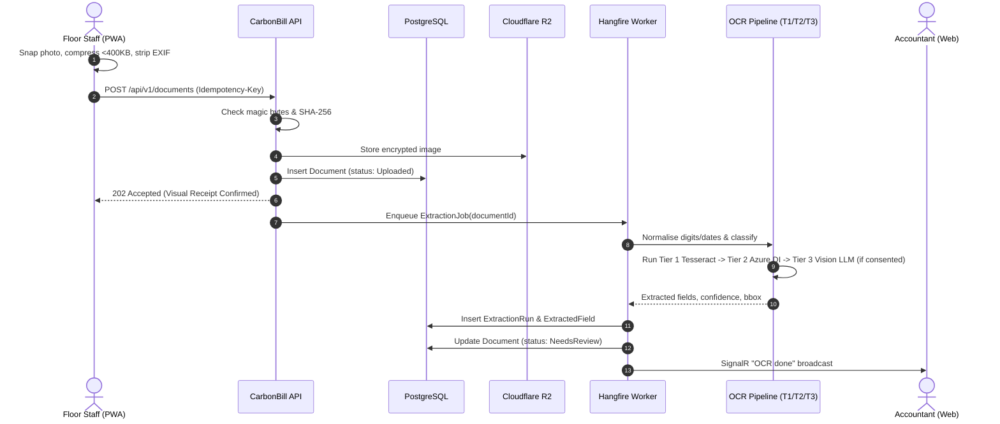
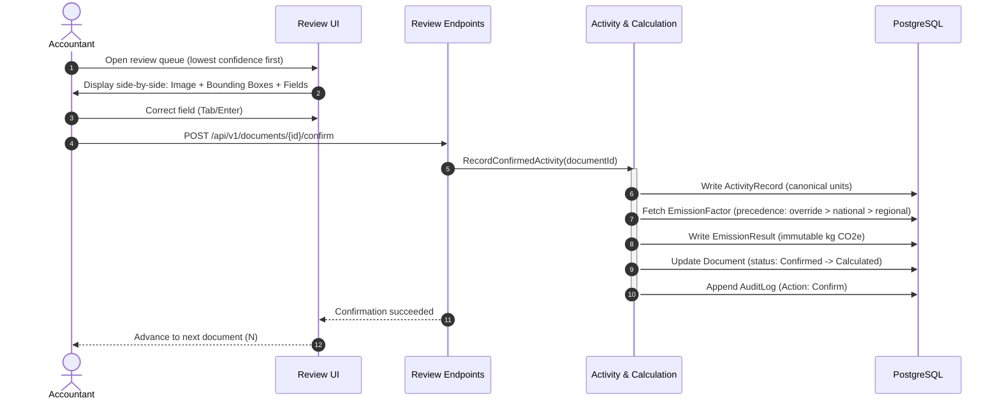
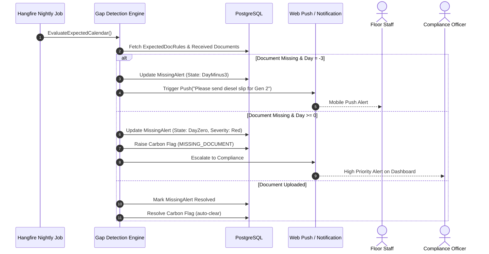
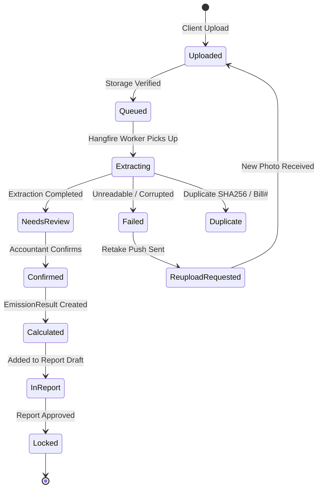
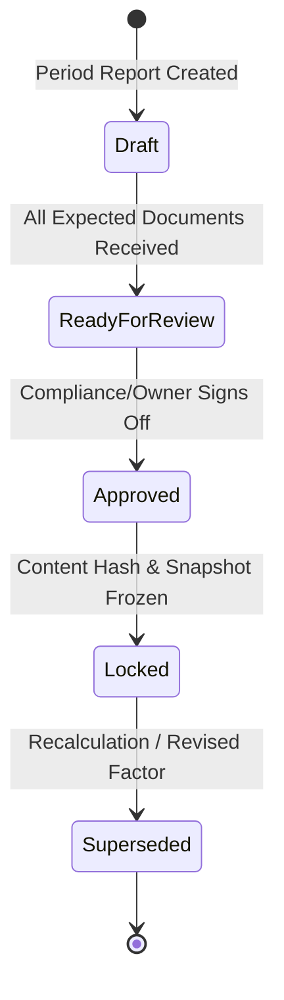
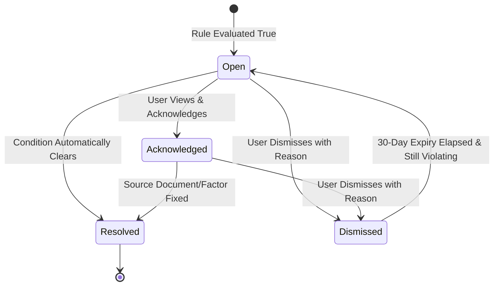
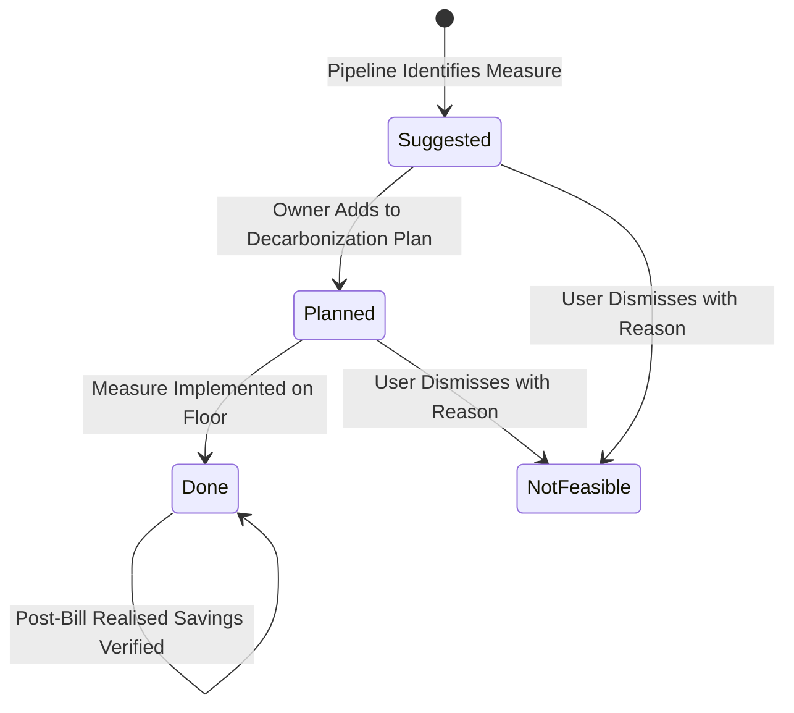

# 06. Core System Flows & State Machines: CarbonBill

## 1. Core End-to-End Workflows

### 1.1 Capture and Extraction Pipeline (The Heart of CarbonBill)

1. **Step 1 (Client Capture & Processing):**
   - Floor staff (Jahid) snaps photo of bill/challan on mobile PWA.
   - Client-side canvas crops, corrects deskew hints, resizes to ~1600 px, strips EXIF GPS metadata, and encodes to WebP/JPEG under ~400 KB.
2. **Step 2 (Offline Queue & Idempotent Transmission):**
   - Encoded image stored in IndexedDB with a client-generated UUID `Idempotency-Key`.
   - Workbox Background Sync (Android) or app-open retry (iOS) automatically transmits file upon internet connectivity.
   - Support for manual fallback entry (litres + slip number now, photo later).
3. **Step 3 (API Receipt & Ingestion):**
   - API inspects magic bytes, validates size limits, computes SHA-256 hash.
   - Fast duplicate rejection by hash.
   - Writes `Document` entity with status `Uploaded`, uploads binary to Cloudflare R2, and returns a 202 receipt immediately (<3 s target) so Jahid sees "received".
4. **Step 4 (Asynchronous Extraction Job in Hangfire):**
   - **Normalise:** Converts Bangla numerals (`১২৩৪৫৬৭৮৯০` -> `1234567890`), standardizes Bangla/Latin dates, normalizes unit spelling variants (`"লিটার"`, `"ltr"`, `"L"` -> `litre`).
   - **Classify:** Classifies doc type (`electricity`, `diesel`, `gas`, `shipping`) by layout heuristics and keywords.
   - **Tier 1:** Runs Tesseract (`ben+eng`) with utility template matching. If all required fields exceed confidence and reconcile (totals match, dates plausible), accept Tier 1.
   - **Tier 2:** If confidence is below threshold, escalates to Azure Document Intelligence F0.
   - **Tier 3:** For handwriting or irregular slips, escalates to Vision LLM with JSON schema (only if organization has consented).
   - Records bounding boxes (`bbox`), source tier, and confidence for every extracted field.
   - Checks for power factor or demand charge penalty lines for bill savings flags.
5. **Step 5 (Completion & SignalR Broadcast):**
   - Transitions Document to `NeedsReview` (or `Failed` with plain-language reason and retake notification).
   - Emits SignalR real-time event `"OCR done"` to accountant's review queue.

---

### 1.2 Review and Confirmation Flow

1. **Queue Inspection:** Accountant (Rahim) opens `/review/queue`, sorted by lowest confidence fields first.
2. **Side-by-Side Review:** Left side displays original scanned invoice with zoom/rotate; right side displays editable fields. Clicking an input highlights the corresponding bounding box on the invoice.
3. **Keyboard-Driven Edit:** Rahim navigates using keyboard shortcuts (`Tab` to move, `Enter` to confirm, `N` for next document). Corrections update `corrected_value` while retaining original OCR text.
4. **Bulk Confirmation (Optional):** After 20 manual confirmations, organizations may enable auto-confirmation for documents exceeding high confidence thresholds; 10% random sample is routed to human review.
5. **Atomic Accounting Transaction:** Upon confirmation:
   - Creates `ActivityRecord` in canonical units (e.g. kWh, litres).
   - Looks up applicable emission factor from `FactorRegistry`.
   - Computes emissions: `kg CO2e = quantity_canonical x factor`.
   - Writes `EmissionResult`, sets Document to `Confirmed`, and logs `AuditLog` in one atomic database transaction.

---

### 1.3 Missing-Data Detection & Escalation Flow

1. **Nightly & Upload Trigger:** Hangfire nightly cron and `DocumentUploaded` event compare `ExpectedDocRules` against received documents for each site, asset, and period.
2. **Calendar Checklist Evaluation:** If an asset lacks a confirmed or uploaded document for the billing period:
   - Generates or updates a `MissingAlert`.
3. **Escalation Schedule:**
   - **Day -7 (7 days before due date):** Low-priority calendar reminder in application.
   - **Day -3 (3 days before due date):** Web Push / In-app notification to responsible floor staff ("Please send diesel slip for Generator 2").
   - **Day 0 (Due Date):** Red severity alert escalated to Compliance Officer / Factory Owner dashboard; Carbon Flag `MISSING_DOCUMENT` raised.
4. **Resolution:** When the missing slip is uploaded, the alert resolves automatically.

---

## 2. State Machines

### 2.1 Document State Machine

### 2.2 Report State Machine

### 2.3 Carbon Flag State Machine

### 2.4 Recommendation State Machine

---

## 3. Assumptions

*No undocumented assumptions made. State transitions and flows accurately follow Sections 7 and 14 of the architecture document.*
