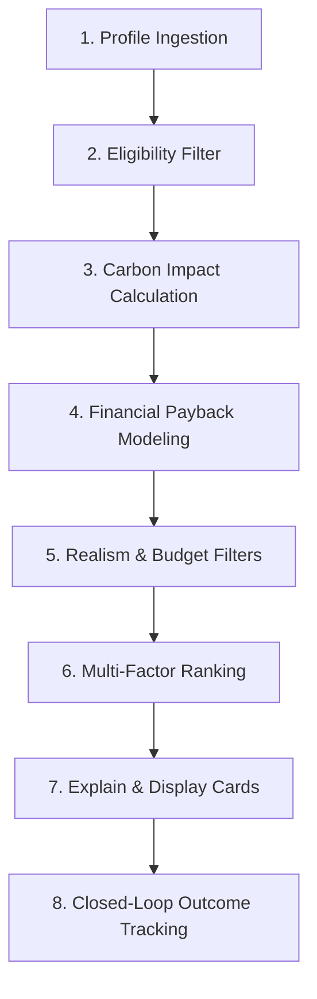

# 09. Evidence-Based Recommendations Engine Specification

## 1. Goal & Architectural Overview

The Recommendations Engine generates a ranked, realistic list of energy-efficiency and carbon-reduction initiatives tailored specifically for small and medium export manufacturing facilities in Bangladesh.

Instead of generic guidance, recommendations use:
- **Taka-First Financial Modeling:** Payback and savings in Bangladeshi Taka (BDT) calculated using the factory's **own utility tariffs** (BDT/kWh and BDT/litre) extracted directly from historical utility bills.
- **Evidence-Graded Measures:** Reduction percentages, costs, and lifespans linked to curated industrial engineering datasets.
- **Honest Ranges:** Displaying Low, Typical, and High estimates instead of false single-number precision.

---

## 2. Measure Library Schema & Evidence Grading

Every measure in `recommendations.measures` represents an audited intervention:

| Field | Type | Description & Purpose |
|---|---|---|
| `measure_id` | `uuid` | Unique measure identifier. |
| `measure_code` | `varchar(50)` | Human-readable identifier (e.g. `VFD_MOTORS`, `BOILER_INSULATION`). |
| `name_bn` / `name_en` | `varchar(200)` | Plain-language title in Bangla and English. |
| `category` | `varchar(50)` | `Lighting`, `Motors`, `CompressedAir`, `Boilers`, `SolarPV`, `PowerFactor`, `Transport`. |
| `applicable_sectors` | `jsonb` | Supported sectors: `["RMG", "TextileDyeing", "Food", "LightEngineering"]`. |
| `applicability_rules` | `jsonb` | Machine-readable prerequisites: `{ "has_boiler": true, "monthly_kwh_gt": 10000 }`. |
| `saving_low` / `typical` / `high` | `numeric(5,4)` | Reduction percentage applied to baseline activity (e.g. `0.10`, `0.15`, `0.22`). |
| `capex_low` / `capex_high` | `numeric(18,2)` | Capital expenditure per kW, per unit, or fixed cost in BDT. |
| `lifetime_years` | `int` | Expected equipment operational lifespan (years). |
| `evidence_grade` | `char(1)` | **A**, **B**, or **C** evidence classification. |
| `source_id` | `uuid` | Foreign key referencing `recommendations.measure_sources`. Must not be null. |
| `local_notes` | `text` | Practical constraints in Bangladesh (e.g. rented building limits, roof structural capacity). |

### Evidence Grade Classifications

- **Grade A (Local Factory Empirical Evidence):**
  Documented and measured energy audit results from operational Bangladeshi export manufacturing facilities (e.g. IFC PaCT audited textile factories).
- **Grade B (Regional / International Industrial Case Studies):**
  Audited case studies from regional South Asian or global industrial facilities with similar operational machinery.
- **Grade C (Engineering Estimates & Manufacturer Specs):**
  Standard thermodynamic or electrical engineering calculations and vendor equipment efficiency ratings.

---

## 3. Candidate Research Sources (Mandatory Citation)

*(All sources require formal citation verification before pilot release - mark as VERIFY)*:
1. **IFC Partnership for Cleaner Textile (PaCT) Case Studies:** *(VERIFY)* Resource efficiency data from 200+ audited Bangladeshi textile and garment factories.
2. **Cascale (formerly SAC) Higg Facility Environmental Module (FEM):** *(VERIFY)* Guidance notes on industrial energy conservation.
3. **SREDA (Sustainable and Renewable Energy Development Authority):** *(VERIFY)* Rooftop solar net-metering guidelines and benchmark installation costs in Bangladesh.
4. **IDCOL & Bangladesh Bank Green Transformation Fund:** *(VERIFY)* Concessionary green finance terms and eligibility criteria.
5. **Global Solar Atlas (World Bank Group):** Specific PV yield calculations (kWh/kWp) for Dhaka, Chittagong, and Gazipur coordinates.
6. **Published DEFRA / IPCC Emission Datasets:** Conversion factors connecting energy savings to avoided carbon.

---

## 4. Starter Measure List

1. **Power Factor Correction:** Capacitor bank tuning to eliminate DESCO/DPDC low-power-factor penalties.
2. **LED & Daylighting Upgrades:** High-efficiency LED tubes and prismatic skylights in production floors.
3. **Variable Frequency Drives (VFD):** Inverter drives on compressors, blowers, and sewing motor shafts.
4. **Compressed Air Leak Repair:** Ultrasonic leak detection, pressure regulation (reducing from 7 to 6 bar).
5. **Boiler Insulation & Steam Trap Maintenance:** Thermal pipe jackets, condensate recovery, burner tuning.
6. **Rooftop Solar PV:** Grid-tied rooftop solar with net metering under SREDA guidelines.
7. **Generator Grid-First Scheduling:** Automated changeover logic and genset right-sizing.
8. **Servo Motors on Sewing Machines:** Replacing legacy clutch motors with energy-efficient direct-drive servos.
9. **Waste Heat Recovery:** Economizers on boiler exhaust flues to pre-heat boiler feedwater.
10. **Freight Logistics Consolidation:** Vehicle routing optimization, maintenance, and tire pressure management.

---

## 5. The 8-Step Recommendation Pipeline

### Step 1: Profile Ingestion
Extracts confirmed baseline activity (monthly kWh, diesel litres, gas m3) and calculates the factory's **own effective utility tariff**:
$$\text{Tariff}_{\text{electricity}} = \frac{\text{Total BDT on Bill}}{\text{Total kWh on Bill}} \quad (\text{BDT/kWh})$$
$$\text{Tariff}_{\text{diesel}} = \frac{\text{Total BDT on Bill}}{\text{Total Litres on Bill}} \quad (\text{BDT/litre})$$
Combines with onboarding questionnaire (has boiler, has genset, roof area, budget band).

### Step 2: Eligibility Filtering
Applies `applicability_rules`. Discards measures that cannot apply (e.g. if `roof_area` is zero or building is rented, eliminate Rooftop Solar).

### Step 3: Carbon Impact Calculation
Computes avoided greenhouse gas emissions for Low, Typical, and High ranges:
$$\text{Avoided tCO}_2\text{e} = \frac{\text{Baseline Activity} \times \text{Saving \%} \times \text{Emission Factor}}{1000}$$

### Step 4: Financial Payback Modeling (In Taka)
$$\text{Annual Savings (BDT)} = \text{Avoided Energy Units} \times \text{Factory Tariff (BDT/unit)}$$
$$\text{Simple Payback (Years)} = \frac{\text{Total Capex (BDT)}}{\text{Annual Savings (BDT)}}$$
$$\text{Cost per Avoided tCO}_2\text{e} = \frac{(\text{Annualised Capex} - \text{Annual Savings})}{\text{Annual Avoided tCO}_2\text{e}}$$
*(A negative cost per tonne indicates the investment yields net positive financial returns).*

### Step 5: Realism Filters
Hides options exceeding factory's stated budget band or requiring lead times beyond feasibility. If capex exceeds threshold ($> 1,000,000$ BDT), prompts: *"Detailed site audit recommended before capital commitment"*.

### Step 6: Multi-Factor Ranking
Ranks eligible measures using a composite score:
$$\text{Score} = w_1 \cdot \text{Payback} + w_2 \cdot \text{Avoided tCO}_2\text{e} + w_3 \cdot \text{Evidence Grade} - w_4 \cdot \text{Capex}$$
Displays the **top 5 measures** as actionable cards and presents the complete portfolio on a Marginal Abatement Cost Curve (MACC) chart.

### Step 7: Explain & Display Cards
Each card displays:
- "Why this measure?" (derived directly from the factory's own bills).
- Range of savings (Low / Typical / High in BDT and tCO2e).
- Evidence Grade badge (A, B, or C).
- Source citation and link to green finance opportunities (e.g. IDCOL refinancing).

### Step 8: Closed-Loop Outcome Tracking
User transitions measure state: `Planned` -> `Done` or `NotFeasible` (with mandatory reason).
When marked `Done`, the system compares pre-intervention and post-intervention utility bills:
$$\text{Realised Savings} = \text{Baseline Period Energy} - \text{Post-Intervention Energy}$$
Records actual empirical performance in BDT, enabling CarbonBill to accumulate domestic empirical evidence and elevate Grade B/C measures toward Grade A.

---

## 6. Honesty & Credibility Rules

1. **Always Express as Ranges:** Single-point estimates (e.g. "Save exactly 15%") are forbidden. Always show low, typical, and high ranges.
2. **Never Guarantee Savings:** System copy must explicitly state that calculations are engineering estimates subject to operating practices.
3. **No Machine Learning in MVP:** Recommendations rely strictly on transparent, deterministic arithmetic rules and published research datasets.
